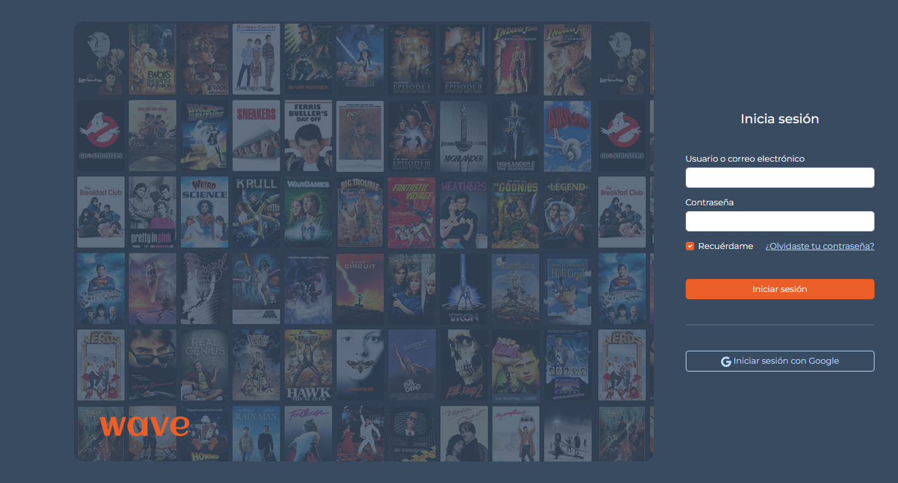
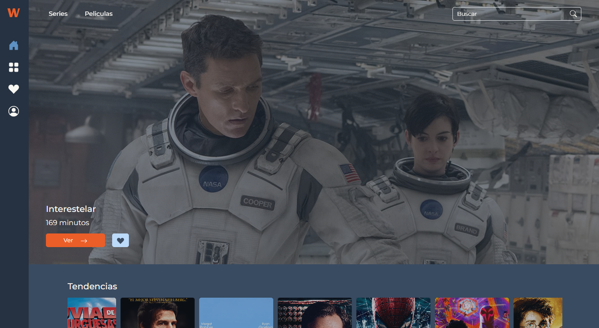
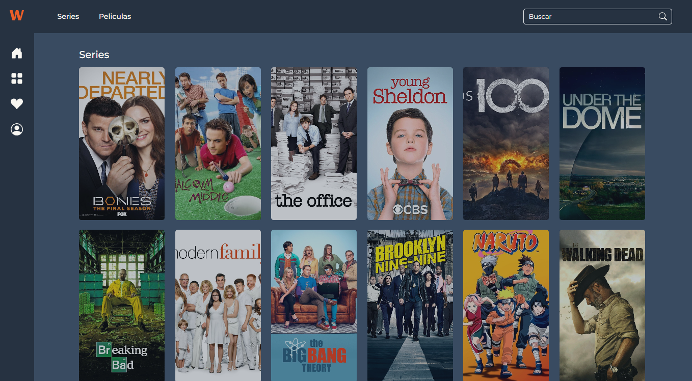
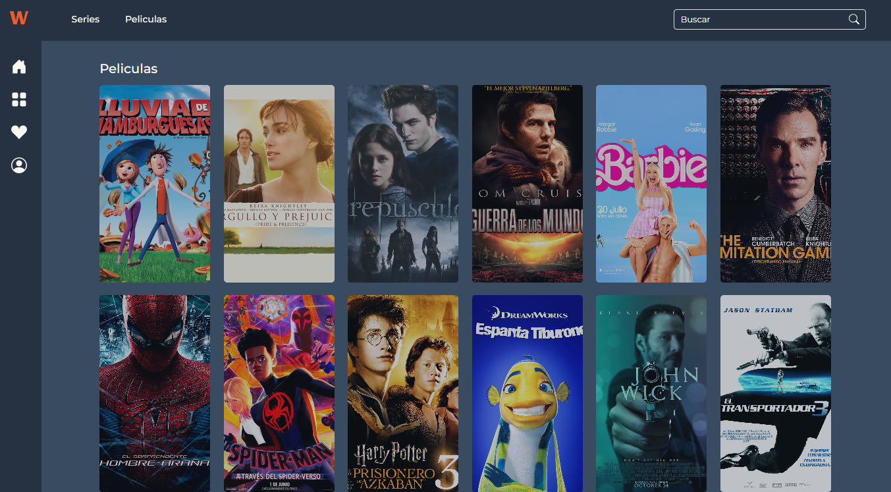
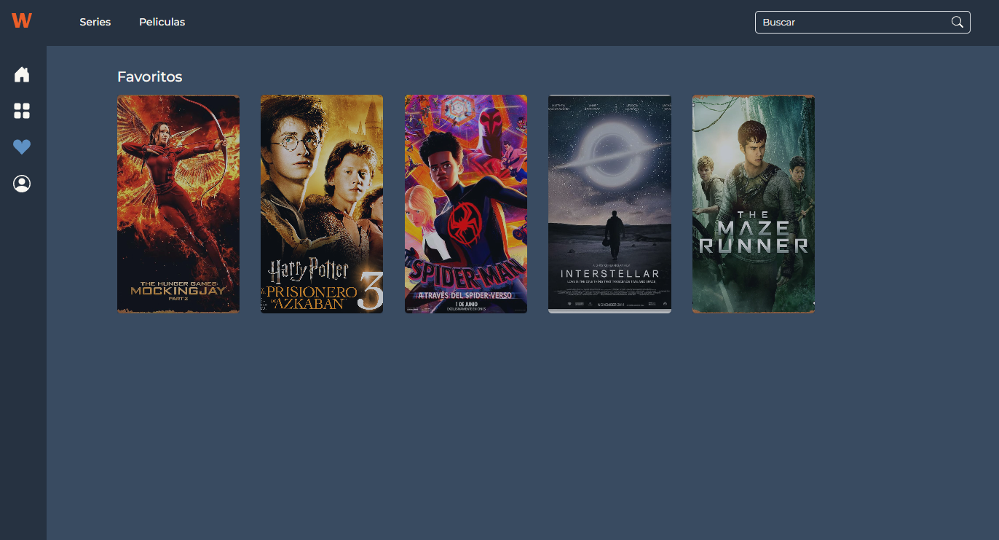

### Hub de entretenimiento - WAVE

#### Diana Lizeth Alcala Sandoval

En mi proyecto, creé un hub de entretenimiento al cual llamé "WAVE" que cuenta con un catálogo de películas y series (actualmente con información hardcodeada), que permite a los usuarios agregar películas a sus favoritos y acceder a detalles completos de cada película.

---

##### Requerimientos técnicos

Para el desarrollo del proyecto, me apoyé en Bootstrap tanto para el CSS como para algunas funcionalidades que requieren de JS.

También utilicé CSS puro para crear mis propias clases y personalizar algunas otras. Al igual, utilicé JS puro para crear ciertas funciones en el proyecto, por ejemplo: agregar a favoritos una película o que al hacer scroll cambie de color el navbar.

Además, utilicé una librería llamada Flickity (esta librería está hecha con JS y CSS), que permite la creación de carruseles. Estos carruseles los utilicé para mostrar el catálogo de películas y series.

---

##### Uso del proyecto

Para poder hacer uso del proyecto, no es necesaria la instalación de ningún paquete o librería.

---

##### Proyecto

A continuación, se muestran capturas de pantalla del proyecto y una breve explicación de lo que se presenta en cada captura.

###### Vista - Inicio de sesión

En esta captura se muestra el inicio de sesión del hub de entretenimiento.

###### Vista - Inicio

Después de que el usuario inicie sesión, se le mostrará la vista de inicio que se muestra en la captura. En la parte superior se muestra una sección con lo que corresponde a las películas más populares y más abajo aparecen carruseles con el catálogo de películas y series.

###### Vista - Series

En esta captura se muestra la vista donde aparecen todas las series disponibles.

###### Vista - Películas

En esta captura se muestra la vista donde aparecen todas las películas disponibles.

###### Vista - Película

En esta captura se muestra la vista de una película.

###### Vista - Favoritos

En esta captura se muestra la vista donde aparecen todas las películas favoritas del usuario.

_**Nota**: la información que se encuentra en el proyecto esta hardcodeada, por lo tanto no todas las películas y series mostradas tienen la funcionalidad para agregarlas a favoritos y para ver su información de manera individual, las únicas que cuentan con estas funcionalidades son las mostradas en la captura anterior._

---

##### Proceso para realizar el proyecto

Para llevar a cabo el desarrollo de mi proyecto, lo primero que hice fue pensar en el nombre que quería que llevara mi hub de entrenimiento y el nombre que escogí fue "WAVE", haciendo alución a las olas del mar ya que la idea es que los usuarios puedan navegar entre diferentes universos de las peliculas y series. Y también creé una paleta de colores y un logotipo, para realizar esto me apoyé del uso de inteligencias artificiales.

Después lo que hice fue crear un boceto a mano de lo que quería para mi interface para esto estuve buscando ideas para inspirarme.

Luego de tener toda la idea de lo que quería para mi proyecto, comencé con su desarrollo todos los días por las noches ya que la mayor parte de mi tiempo la paso en la universidad.

---

##### Sprint review

| ¿Qué salió bien?                                                                                  | ¿Qué puedo hacer diferente?                                                                                                                                                                                                                                                     | ¿Qué no salió bien?                                                                                                                        |
| ------------------------------------------------------------------------------------------------- | ------------------------------------------------------------------------------------------------------------------------------------------------------------------------------------------------------------------------------------------------------------------------------- | ------------------------------------------------------------------------------------------------------------------------------------------ |
| Lo que considero que salió bien fue que logré plasmar la idea que tenía de mi proyecto en código. | Lo que considero que podría hacer diferente es la manera en que estoy manejando la información del proyecto, ya que todo se encuentra hardcodeado y así es más díficil hacer dinámico mi proyecto, también considero que podría organizar mejor mis tiempos para el desarrollo. | Lo que considero que no salió bien fue la organización de mis tiempos, siento que no me organicé tan bien para el desarrollo del proyecto. |
